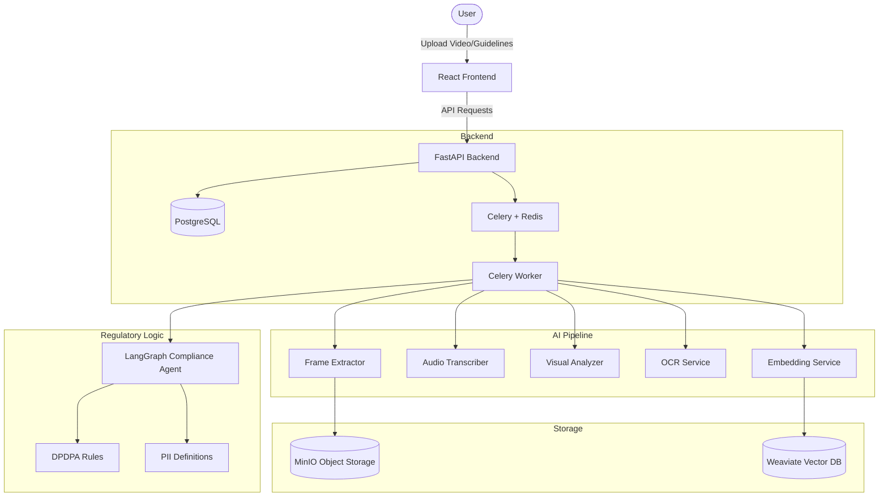
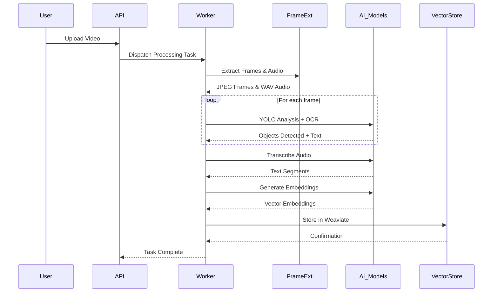

# Technical Design Document: Regtech Video Compliance

## 1. System Overview
The Regtech Video Compliance Checker is an AI-powered system designed to automate the process of checking video content against regulatory guidelines, specifically the **Digital Personal Data Protection Act (DPDPA)**. It utilizes a 100% open-source AI stack to extract visual and auditory information from videos, vectorize the content for semantic search, and assess compliance using a Retrieval-Augmented Generation (RAG) approach.

## 2. System Architecture
The system follows a modular architecture consisting of a FastAPI backend, a Celery task queue for long-running video processing, and multiple specialized AI services.

## 3. Module Breakdown

### 3.1 Core Application (backend/app)
| Module | Description |
|--------|-------------|
| `main.py` | FastAPI application entry point. Handles routing, middleware, and application lifespan. |
| `config.py` | Configuration management using Pydantic Settings. Manages environment variables and service URLs. |
| `db/session.py` | Database session management using SQLAlchemy and PostgreSQL. |

### 3.2 AI & Processing Services (backend/app/services)
| Service | Functionality |
|---------|---------------|
| `video_content_vectorizer.py` | **Pipeline Orchestrator**. Coordinates extraction, analysis, embedding, and storage. |
| `frame_extractor.py` | Extracts frames using **OpenCV** with scene change detection. Extracts audio using **FFmpeg**. |
| `visual_analyzer.py` | Performs object detection using **YOLO v8** (e.g., detecting people, screens, devices). |
| `audio_transcriber.py` | Transcribes audio to text using **OpenAI Whisper** (local). |
| `ocr_service.py` | Extracts text from frames using **Tesseract OCR** with a pattern-based fallback. |
| `embedding_service.py` | Generates 768-dimensional vectors using **sentence-transformers** (`all-mpnet-base-v2`). |
| `vector_store.py` | Manages **Weaviate** collections (`VideoContent` and `Guidelines`). |

### 3.3 Regulatory & Privacy Intelligence (backend/app/dpdpa & app/pii)
| Module | Description |
|--------|-------------|
| `dpdpa/definitions.py` | Structured definitions of ~35 DPDPA rules across 10 categories (Consent, Children's Data, etc.). |
| `dpdpa/penalty_schedule.py` | Maps violations to DPDPA penalty tiers (up to 250 crore INR). |
| `pii/definitions.py` | Regex patterns and categories for 11+ types of PII (Aadhaar, PAN, Phone, etc.). |

## 4. System Interactions (Sequence Diagram)

### 4.1 Video Processing Pipeline (Step 1)
This diagram shows the flow from video upload to its representation in the vector database.

## 5. Technology Stack
- **Framework**: FastAPI (Python)
- **Execution**: Celery + Redis
- **Database**: PostgreSQL (Structured), Weaviate (Vector)
- **Storage**: MinIO (S3-compatible)
- **AI Stack**:
    - **Vision**: YOLO v8, OpenCV
    - **Audio**: Whisper
    - **OCR**: Tesseract
    - **NLP**: Sentence-Transformers, Llama 3.1 (via Ollama)
    - **Orchestration**: LangChain, LangGraph

## 6. Compliance Engine Logic
The compliance engine uses a "Trigger-Verify-Report" logic:
1.  **Trigger**: Detected content (e.g., a "person" or "PII text") triggers specific DPDPA rules.
2.  **Verify**: The LangGraph agent queries Weaviate for evidence (transcriptions, OCR, object context).
3.  **Report**: If a violation condition is met (e.g., "Person detected but no consent indication"), a report is generated with the relevant DPDPA section and penalty.
